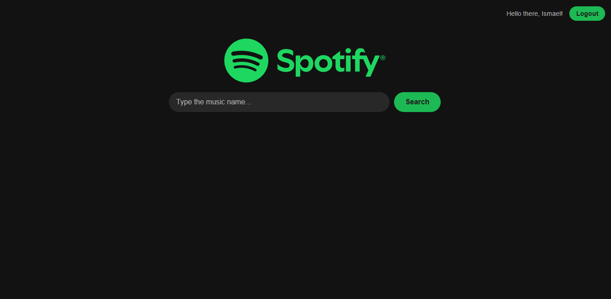
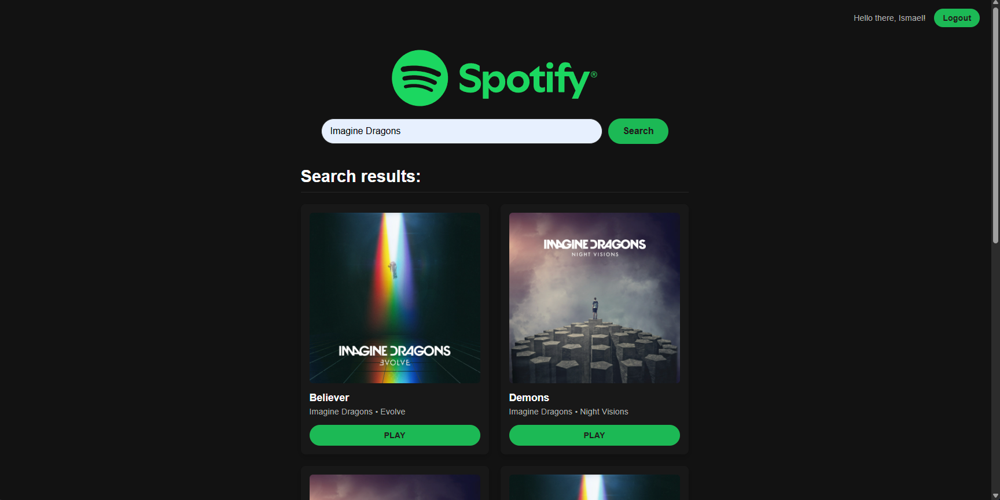
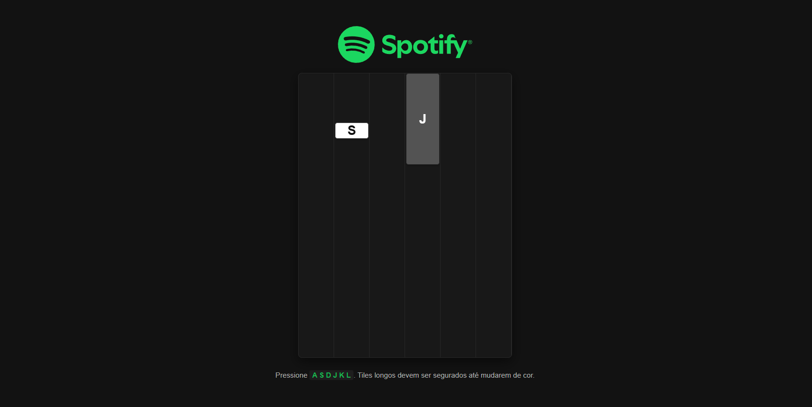

# mySpotiTile
A Spotify API-based tile game built over a weekend. Runs in browser with PKCE. You will need a spotify premium account to play it. This is a personal project with no affiliation to Spotify.

If you want to download and try it you will probably need to change the **client id** and the **redirect url**.
I really would like to add more updates like a good mobile compatibility and a synchronized generations of tiles according to the music beat, but my time is up for now.

## App images in case its not available

### First Page

### Second Page

### Third Page

